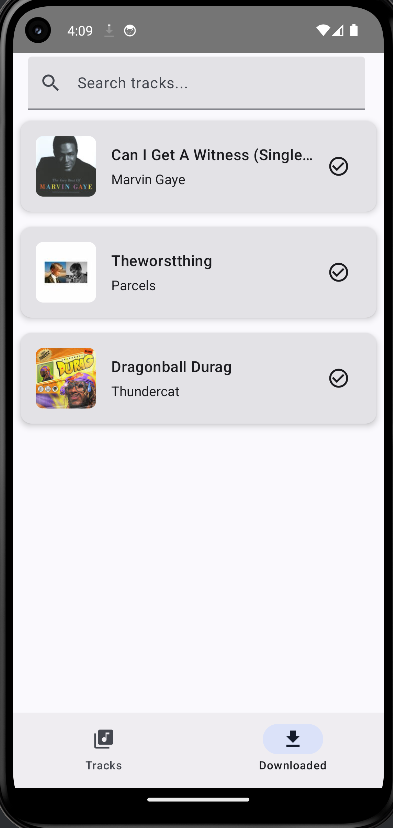
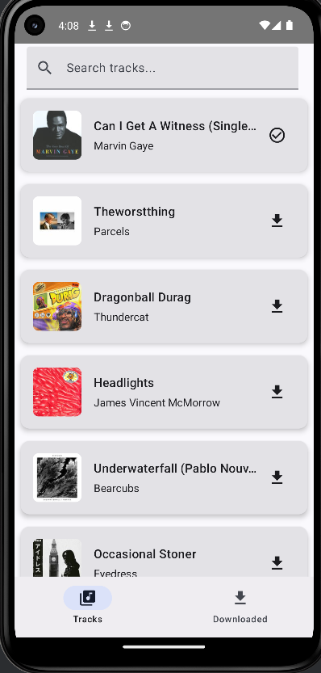
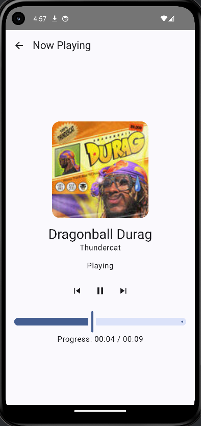
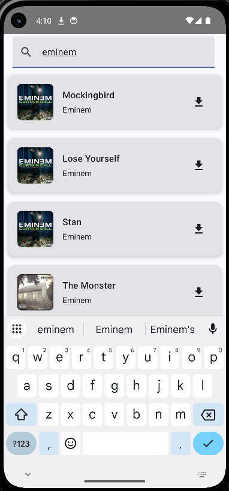
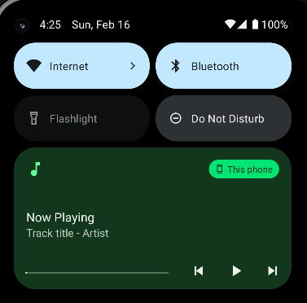

# Music App

Тестовое задание для стажёра Android-направления (зимняя волна 2025)

## Описание

Данное приложение позволяет:

- Искать музыку через открытый Deezer API.
- Воспроизводить найденные треки (превью, предоставляемые API).
- Управлять воспроизведением (пауза, продолжение, переход к следующему/предыдущему треку).
- Воспроизводить локальную музыку, включая поиск по ней.

Приложение состоит из трёх основных экранов:

1. **Экран скачанных треков (Downloaded Tracks)**  
   Отображает список локально сохранённых треков с возможностью поиска.
2. **Экран треков из API (Tracks)**  
   Отображает список треков, полученных через Deezer API (по умолчанию  
   с [https://api.deezer.com/chart](https://api.deezer.com/chart) и через  
   поиск [https://api.deezer.com/search?q={query}](https://api.deezer.com/search?q={query})).
3. **Экран воспроизведения (Player Screen)**  
   При выборе трека пользователь попадает на экран воспроизведения, где отображаются обложка,  
   название, исполнитель, прогресс воспроизведения и контролы (пауза/воспроизведение,  
   следующий/предыдущий трек).

Также реализован **фоновый плеер** на основе Foreground Service. Приложение продолжает  
воспроизводить музыку при сворачивании, а в статус-баре отображается уведомление с контролами  
воспроизведения.

## Технологический стек

- **Язык:** Kotlin
- **UI:** Jetpack Compose
- **Навигация:** Navigation Compose (более оптимальное решение при работе с Jetpack Compose)
- **Многопоточность:** Kotlin Coroutines + Flow
- **Медиа:** ExoPlayer для воспроизведения треков
- **Фоновый режим:** Foreground Service
- **Dependency Injection:** Dagger2
- **Сетевое взаимодействие:** Retrofit, OkHttp
- **Архитектура:** Clean Architecture + MVVM
- **Сериализация:** Gson

## Структура проекта

В проекте используются слои для логического разделения:

- **domain** — бизнес-логика, use-cases.
- **data** — репозиторий, модели для работы с сетью.
- **presentation** — экраны, ViewModel, UI-слой (Compose).
- **di** — настройка Dagger2 (компоненты и модули).

Основные экраны:

- **DownloadedTracksScreen** — список скачанных треков.
- **TracksScreen** — список треков из Deezer API.
- **PlayerScreen** — экран воспроизведения выбранного трека.

## Навигация

- **BottomNavigation**: переключение между локальными треками и треками из API.
- **Переход к PlayerScreen**: по нажатию на трек пользователь переходит к экрану воспроизведения.

## Скриншоты

Ниже приведены скриншоты приложения:

